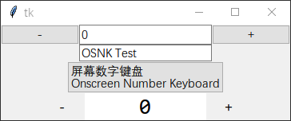
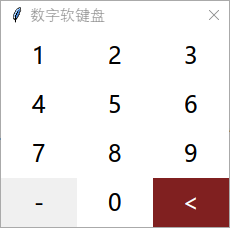
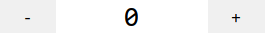
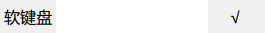

# tttk中文文档

2022 By 真_人工智障

tttk是一个tkinter的增强库，旨在扩展tkinter可使用的控件。**注意：tttk并不能起到美化作用。**

这些控件并非为此所制作，而是整理于我过去开发的程序，这些程序中的一部分中会有这种可移植的有趣玩意。

## For English Speakers

U can translate this doc with a translate software. **(Do not use Google Translate to Translate Chinese into English, because Google Translate is famous 4 its RUBBISH TRANSLATION in China)**

I **can** translate this doc but I'm too lazy. If you want to do it 4 me, please contact me at tt1224@hotmail.com.

## 其他推荐的tkinter扩展

这个库里的控件十分稀少，如果你需要更多好玩的控件，那么以下是推荐的库：

- tkwebview2，这个库包含1个控件，它可以在tkinter窗口中显示网页，但您需要先安装EdgeWebview2。
- ttkbootstrap，一个控件库，为ttk提供崭新的视觉样式，但在每一版操作系统上都如此，所以在某些系统中会存在违和感。该库兼容性不佳，需要高版本Python。
- TinUI，一个美观的控件库，风格为仿WinUI，通过该库的主题可实现跟随系统自动深浅色。但是相较于ttkbootstrap，它有些不易用，因为在推荐的三者中，这是唯一一个基于canvas的库。主要作者称这只是业余制作的控件库，所以该库效果不佳。

## 取名

因为ttk可以理解为tkinter的增强版，故tttk也可理解为ttk的增强版。

## 高度定制

如果直接在实例化时传入的参数无法满足您的需求，您可以直接修改控件中某一部分的属性，每个部分都是该类的一个属性。

例：

```python
import tkinter as tk
from tttk import tttk

win=tk.Tk()

numenter=tttk.NumEnter(win)
numenter.btnsub['bg']='#FF5050'
numenter.btnadd['bg']='#50FF50'
numenter.frame.pack()

win.mainloop()
```


## Demo和测试

运行库目录中的`test.py`来查看控件，以下是运行效果：



## 代码中无用的内容

### 无用（或禁止使用）的函数

请勿调用在文档中注明“开发者无需自行调用”的函数。

### 无用的参数

代码中命名以`xx_`开头的参数为无用参数，您无需填入，文档中也不会进行任何介绍。

## 所有类

### NumEnterOld

简单数字输入框，输入框左右两侧分别有“-”、”+“，可以给数字-1或+1。输入框可以输入数字。

该控件较为简陋但符合系统自带控件样式，建议使用[NumEnter](#NumEnter)来替代。


#### 参数

|  名称  |   解释   |  数据类型  | 默认值 |
| :----: | :------: | :--------: | :----: |
|  win   | 所在窗口 | tkinter.Tk |        |
| value  |  起始值  |    int     |   0    |
| minnum |  最小值  |    int     |  None  |
| maxnum |  最大值  |    int     |  None  |

#### 函数

##### refresh

由其他函数自动调用，开发者无需自行调用。

##### changeui

修改数值的界面，点击输入框后自动调用，可以直接调用来显示编辑界面。

###### 参数

（无）

##### refresh_with_numenter

由其他函数自动调用，开发者无需自行调用。

##### sub

将值减去指定的数。

###### 参数

| 名称  |          解释          | 数据类型 | 默认值 |
| :---: | :--------------------: | :------: | :----: |
| event | 其他位置调用时自动填入 |          |        |
|  num  |        减去的数        |   int    |   1    |

##### add

将值增加指定的数。

###### 参数

| 名称 |   解释   | 数据类型 | 默认值 |
| :--: | :------: | :------: | :----: |
| num  | 增加的数 |   int    |   1    |

##### get

获取当前的值

###### 参数

（无）

####　放置控件

调用xxx.frame.place/pack/grid即可。

### Osnk

屏幕数字小键盘，初始化后会自动弹出窗口，触屏用户可以借助窗口上的按钮快速输入数字。



#### 参数

| 名称  |      解释      |   数据类型    |    默认值    |
| :---: | :------------: | :-----------: | :----------: |
| root  |    父级窗口    |  tkinter.Tk   |              |
| entry |  绑定的输入框  | tkinter.Entry |              |
| title | 小键盘窗口标题 |      str      | '数字软键盘' |

#### 函数

（无）

### NumEnter

数字输入框，输入框左右两侧分别有“-”、”+“，可以给数字-1或+1。输入框可以输入数字。

该控件中的“输入框”并非真正的输入框，而是通过Label和按键绑定制作的伪输入框。（我踏🐎花了一中午来写这个……）下文为了叙述简单，一律用“输入框”代替本控件的该部分。





#### 参数

|   名称   |     解释     |  数据类型  |  默认值   |
| :------: | :----------: | :--------: | :-------: |
|   win    |   所在窗口   | tkinter.Tk |           |
|  value   |    起始值    |    int     |     0     |
|  width   |  输入框宽度  |    int     |     7     |
| fontsize |   字体大小   |    int     |    20     |
|  minnum  |    最小值    |    int     |   None    |
|  maxnum  |    最大值    |    int     |   None    |
|    bg    |  按钮背景色  |    str     |   None    |
|    fg    |  按钮前景色  |    str     |   None    |
|  txtbg   | 输入框背景色 |    str     | '#FFFFFF' |

#### 函数

##### refresh

由其他函数自动调用，开发者无需自行调用。

##### changeui

修改数值的界面，双击输入框后自动调用，可以直接调用来显示编辑界面。

###### 参数

（无）

##### insert

在值的末尾添加数位。

###### 参数

| 名称 |        解释         | 数据类型 | 默认值 |
| :--: | :-----------------: | :------: | :----: |
| num  | 添加的数位（仅1位） |   str    |  '0'   |

##### index

为兼容[Osnk](#Osnk)而创建，只会返回“0”，开发者无需自行调用。

##### delete

当通过changeui调起Osnk，或将Osnk绑定到NumEnter后，单击Osnk上的退格会自动触发。直接调用可以删除末位数字。

###### 参数

（无）

##### refresh_with_numenter

由其他函数自动调用，开发者无需自行调用。

##### sub

将值减去指定的数。

###### 参数

| 名称 |   解释   | 数据类型 | 默认值 |
| :--: | :------: | :------: | :----: |
| num  | 减去的数 |   int    |   1    |

##### add

将值增加指定的数。

###### 参数

| 名称 |   解释   | 数据类型 | 默认值 |
| :--: | :------: | :------: | :----: |
| num  | 增加的数 |   int    |   1    |

##### get

获取当前的值

###### 参数

（无）

##### osnk

由其他函数自动调用，开发者无需自行调用。

####　放置控件

调用xxx.frame.place/pack/grid即可。